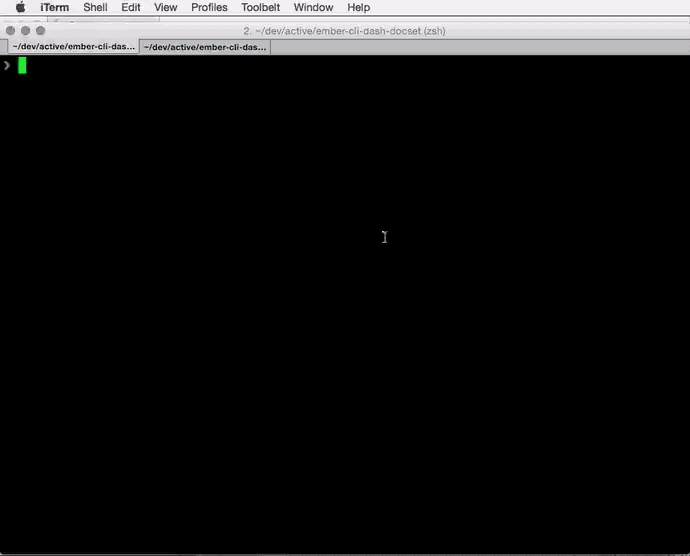

**It's been a minute...  No longer maintaining this so changing status to public archive...**

# Ember-cli-dash-docset [![Build Status][travis-badge]][travis-badge-url]

Generates [Dash](http://kapeli.com/dash) docs from YUIDoc output for ember-cli apps

See also: [ember-cli-yuidoc](https://github.com/cibernox/ember-cli-yuidoc)

YUIDocs should be generated prior to running



## Install

`ember install:npm ember-cli-dash-docset`

## Configuration

`dashdoc.json` contains directives that control the generated docset

```
{
  "name": "docset-data", <---- output docset name
  "outdir": "docset",    <---- where to put it
  "input": "docs",       <---- where to get the YUI generated docs
  "icon": "tests/fixtures/icon.png", <--- Optional image (32x32 png) 
  "dash": {
    "bundleIdentifier": "sample", 
    "bundleName": "sample",
    "docSetFamily": "sample",
    "docSetPlatformFamily": "sample",
    "docSetIndexPath": "index.html"
  }
}
```

## Running

`ember ember-cli-dash-docset`

## Contributing

PRs accepted

should pass `jshint .` and have tests

## Running Tests

* `npm test`

[travis-badge]: https://travis-ci.org/jschilli/ember-cli-dash-docset.svg?branch=master
[travis-badge-url]: https://travis-ci.org/jschilli/ember-cli-dash-docset
